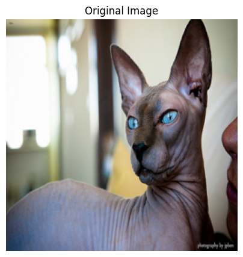
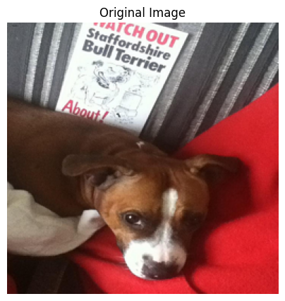
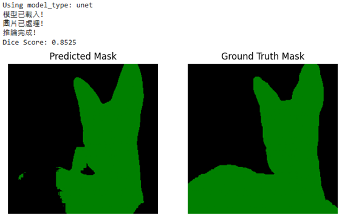
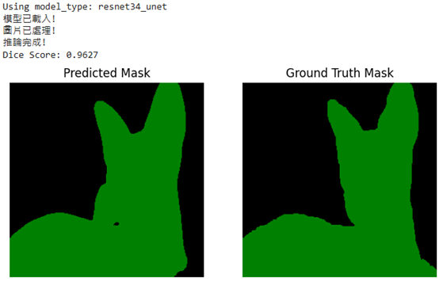
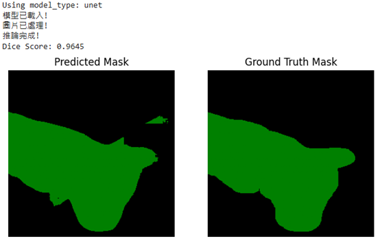
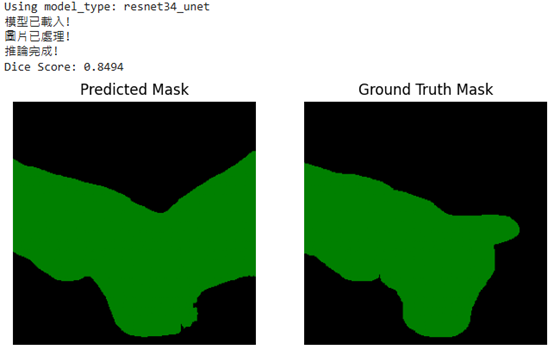

# Lab 2 — Binary Semantic Segmentation
Deep Learning @ NYCU (Spring 2025, TAICA)

This project implements **binary semantic segmentation** on the **Oxford-IIIT Pet Dataset**, focusing on distinguishing pets (foreground) from background at the pixel level.

---

## 📌 Overview
- **Task**: Binary semantic segmentation (foreground vs background)
- **Dataset**: Oxford-IIIT Pet Dataset ([link](https://www.robots.ox.ac.uk/~vgg/data/pets/))  
- **Models**:
  1. UNet (from scratch)  
  2. ResNet34 + UNet (ResNet34 encoder, UNet decoder)  

---

## ⚙️ Environment
Model training environment: **Google Colab Pro+ (NVIDIA A100)**  

| Package       | Version   |
|---------------|-----------|
| torch         | 2.6.0+cu124 |
| torchvision   | 0.21.0+cu124 |
| numpy         | 2.0.2     |
| pandas        | 2.2.2     |
| pillow        | 11.1.0    |
| tqdm          | 4.67.1    |
| matplotlib    | 3.10.0    |

---

## 📂 File Structure
```
Deep-Learning/
 ├─ LAB2/
 │   ├─ report.pdf
 │   ├─ code.py
 │   └─ README.md
```


---

## 📊 Inference Results Comparison

### Picture 1 — Original Images
| Original Image 1 | Original Image 2 |
|------------------|------------------|
|  |  |

---

### Picture 2 — Model Predictions
| **Result on UNet** | **Result on ResNet34_UNet** |
|--------------------|------------------------------|
|  |  |
|  |  |

*Figure: Comparison between UNet and ResNet34_UNet predictions, based on Picture 1 inputs.*


--- 
## 📄 Report 
Full experiment report and discussion are in: [report.pdf](report.pdf)


