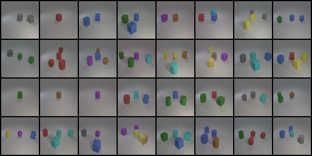
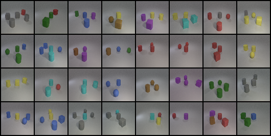
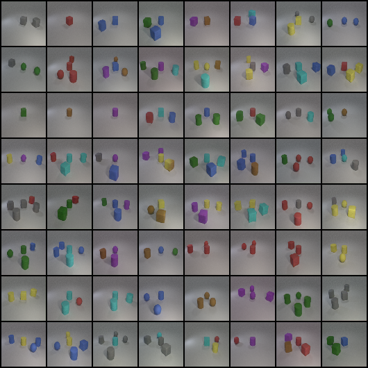
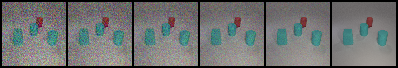

# Lab 6 — Generative Models  
Deep Learning @ NYCU (Spring 2025, TAICA)

This project implements a **conditional Denoising Diffusion Probabilistic Model (DDPM)** to generate synthetic images according to **multi-label conditions** (e.g., *“red sphere”*, *“yellow cube”*, *“gray cylinder”*).

---

## 📌 Overview
- **Task**: Conditional image generation using DDPM  
- **Dataset**: Provided in `file.zip` (train.json, test.json, new_test.json, object.json, evaluator, checkpoint)  
- **Goal**:  
  1. Train a conditional DDPM with custom embedding and noise schedule  
  2. Generate synthetic images from conditions  
  3. Evaluate generated images with the pre-trained ResNet18 evaluator  
  4. Show results: image grids & denoising process  

---

## ⚙️ Environment
Training environment: **Google Colab Pro+ (NVIDIA A100)**  

| Package       | Version   |
|---------------|-----------|
| torch         | ≥ 2.6.0   |
| torchvision   | ≥ 0.21.0  |
| numpy         | ≥ 2.0.0   |
| matplotlib    | ≥ 3.10.0  |
| tqdm          | ≥ 4.67.0  |

---

## 📂 File Structure

```
Lab6/
   ├─ report.pdf
   ├─ src/
   │  ├─ dataset.py
   │  ├─ evaluator.py
   │  ├─ generate_process.py
   │  ├─ test.py
   │  ├─ train.py
   │  └─ images/
   │      ├─ test/
   │      └─ new_test/
   ├─ file/
   │  ├─ all_64_grid.png
   │  ├─ denoise_process.png
   │  ├─ gen_test_grid.png
   │  ├─ gen_new_test_grid.png
   │  ├─ dataset.py
   │  ├─ ddpm.py
   │  ├─ evaluator.py
   │  ├─ eval_all.py
   │  ├─ train.py
   │  ├─ test.py
   │  ├─ objects.json
   │  ├─ train.json
   │  ├─ test.json
   │  ├─ new_test.json
   │  └─ README.md
   └─ iclevr/
      └─ dataset.txt
```
---

## 📦 File Descriptions  

- **report.pdf** — Full experiment report with methodology, results, and discussion.  
- **src/** — Main implementation codes (training, testing, generation, evaluation).  
- **file/** — Provided in `file.zip` (from e3 / NTU COOL):  
  - `train.json`, `test.json`, `new_test.json` — Dataset splits  
  - `objects.json` — Object-label mapping  
  - `evaluator.py`, `eval_all.py` — Pre-trained ResNet18 evaluator scripts  
  - `ddpm.py` — Core DDPM model  
  - `all_64_grid.png`, `gen_test_grid.png`, `gen_new_test_grid.png`, `denoise_process.png` — Generated results & denoising visualization  
  - `readme.txt` — Dataset details  
- **iclevr/** — Extra dataset (`dataset.txt`) provided separately.  

---


## 🚀 How to Run

### Training
```bash
python src/train.py --epochs 200 --batch_size 64 --lr 1e-4
```

---

### Inference
```bash
python src/inference.py --model checkpoint.pth --labels "red sphere, cyan cylinder, cyan cube"
```

---

### Evaluation
```bash
python src/evaluate.py --images images/test --labels dataset/test.json
```

---

## 📊 Results

Synthetic Image Grids:

test.json → 8×4 grid

new_test.json → 8×4 grid

Denoising Process:

["red sphere", "cyan cylinder", "cyan cube"]

(Figures and detailed discussion are in report.pdf
)
```

---

### 3. Results 區塊加圖片連結  
你現在寫了「Figures and detailed discussion are in report.pdf」，但 GitHub README 可以直接放圖，會更直觀。像這樣：  

```markdown
## 📊 Results

- **Synthetic Image Grids**  
  - Test set  
      
  - New test set  
      

- **All 64 samples**  
    

- **Denoising Process**  
    

*(More figures and discussion are in [report.pdf](./report.pdf))*

